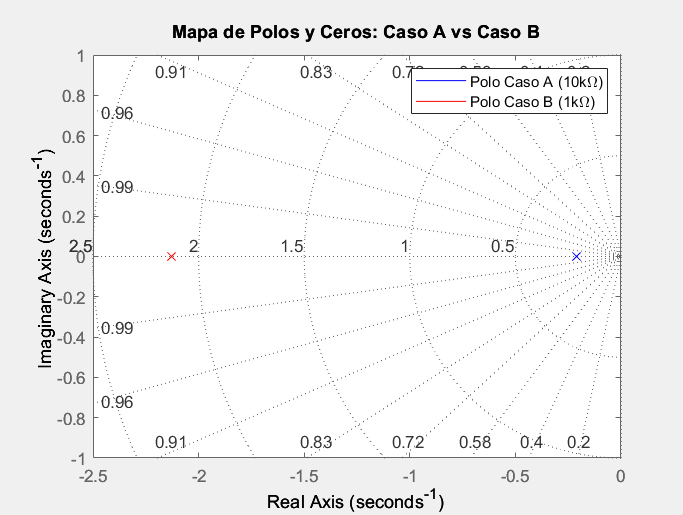
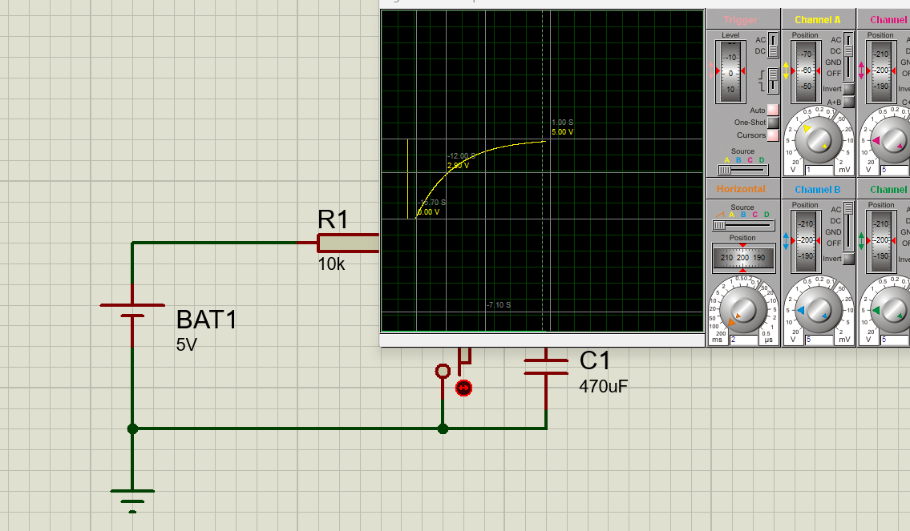
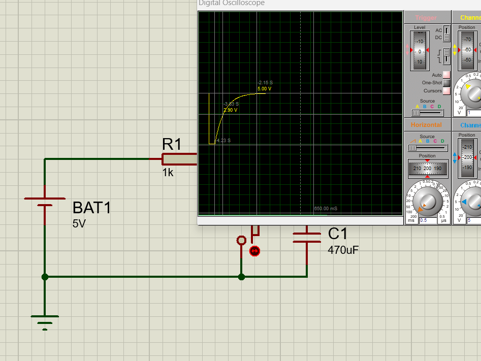

# Análisis de un Circuito RC: Función de Transferencia y Respuesta Temporal

Este repositorio contiene el desarrollo técnico de la actividad de Práctica de Control sobre sistemas de primer orden. Se analiza el comportamiento dinámico de un circuito **Resistencia-Capacitor (RC)** para validar la relación entre sus parámetros físicos, la ubicación de sus polos y su estabilidad.

---

## 1. Fundamentación Teórica

Un circuito RC es un sistema de primer orden cuya dinámica se describe en el dominio de la frecuencia mediante la función de transferencia:

$$H(s) = \frac{1}{RCs + 1}$$

### Parámetros de Diseño:
* **Constante de Tiempo ($\tau$):** Se define como $\tau = R \times C$. Es el tiempo característico que tarda el capacitor en cargar al 63.2% del voltaje de entrada.
* **Ubicación del Polo:** El sistema posee un polo en $s = -1/\tau$. Al situarse en el semiplano izquierdo del plano complejo ($s < 0$), se garantiza que el sistema es **estable**.
* **Tiempo de Establecimiento ($T_s$):** Calculado como $5\tau$, representa el tiempo en el que el sistema alcanza el estado estacionario (99.3% del valor final).

---

## 2. Casos de Estudio

Se comparan dos configuraciones distintas para observar cómo la variación de la resistencia afecta la velocidad del sistema, manteniendo una capacitancia constante de $470 \, \mu F$.

| Parámetro | Caso A (Lento) | Caso B (Rápido) |
| :--- | :--- | :--- |
| **Resistencia ($R$)** | $10,000 \, \Omega$ (10 kΩ) | $1,000 \, \Omega$ (1 kΩ) |
| **Capacitor ($C$)** | $470 \times 10^{-6} \, F$ | $470 \times 10^{-6} \, F$ |


---

## 3. Implementación en MATLAB
Primeramente, obtuvimos los polos de los sistemas a analizar mediante el siguiente código de MATLAB:
```matlab
% Parámetros del Capacitor
C = 470e-6; 

% Sistema Caso A (R = 10k)
Ra = 10000;
tau_a = Ra * C;
Ha = tf([1], [tau_a 1]);

% Sistema Caso B (R = 1k)
Rb = 1000;
tau_b = Rb * C;
Hb = tf([1], [tau_b 1]);

% Generar Mapa de Polos y Ceros
figure;
pzmap(Ha, 'b', Hb, 'r');
grid on;
title('Mapa de Polos y Ceros: Caso A vs Caso B');
legend('Polo Caso A (10k\Omega)', 'Polo Caso B (1k\Omega)');
```
También, se utilizó el siguiente script para modelar ambos sistemas y comparar su respuesta ante una entrada escalón de **5V DC**.

```matlab
% Parámetros del sistema
C = 470e-6; 

% --- Caso A ---
Ra = 10000;
tau_a = Ra * C;
Ha = tf([1], [tau_a 1]);

% --- Caso B ---
Rb = 1000;
tau_b = Rb * C;
Hb = tf([1], [tau_b 1]);

% Simulación de Respuesta al Escalón
t = 0:0.01:25;
[y_a, t_a] = step(5*Ha, t);
[y_b, t_b] = step(5*Hb, t);

% Gráfica Comparativa
plot(t_a, y_a, 'b', t_b, y_b, 'r', 'LineWidth', 2);
grid on;
title('Respuesta Temporal del Circuito RC (Entrada 5V)');
xlabel('Tiempo (s)'); ylabel('Voltaje en el Capacitor (V)');
legend('Caso A: R=10k\Omega', 'Caso B: R=1k\Omega');

```
## 4. Visualización y Análisis de resultados
### Análisis del mapa de polos
Para determinar la estabilidad y la velocidad de respuesta de los sistemas, se calculó la ubicación de sus polos mediante el comando `pzmap` en MATLAB. 

* **Caso A (Polo en $s \approx -0.21$):** El polo se encuentra en el semiplano izquierdo pero muy cerca del eje imaginario (origen). Esto indica que el sistema es estable, pero su respuesta transitoria es lenta.
* **Caso B (Polo en $s \approx -2.12$):** Al reducir la resistencia, el polo se desplaza significativamente hacia la izquierda en el eje real.

<div align="center">
  
  <br>
  <p><i>Mapa de polos.</i></p>
</div>

**Conclusión del Mapa de Polos:** Ambos sistemas son **absolutamente estables** ya que sus polos tienen parte real negativa. Sin embargo, la mayor distancia del polo del Caso B con respecto al eje imaginario confirma matemáticamente que este sistema alcanzará su estado estacionario con mayor rapidez que el Caso A.


### Análisis de la Respuesta Temporal (Entrada Escalón de 5V)

Se comparó la respuesta de ambos sistemas ante una entrada escalón de 5V para observar la velocidad de carga del capacitor en cada configuración. 

* **Caso A (R=10kΩ):** Presenta una curva de ascenso lenta. El sistema tarda aproximadamente **4.7 segundos** ($\tau$) en alcanzar el 63.2% de su carga y llega a su estado estacionario cerca de los **23.5 segundos**.
* **Caso B (R=1kΩ):** Muestra una respuesta significativamente más veloz. Al reducir la resistencia, la constante de tiempo cae a **0.47 segundos**, logrando estabilizarse en apenas **2.35 segundos**.
  
<div align="center">
  
  <br>
  <p><i>Gráfica comparativa.</i></p>
</div>

**Análisis de Resultados:** Ambas señales convergen exactamente al mismo valor final (5V), lo que confirma que la ganancia estática ($K$) es unitaria en ambos casos. Sin embargo, la diferencia en la pendiente de las curvas demuestra físicamente cómo el valor de la resistencia limita el flujo de corriente y, por ende, controla la velocidad de respuesta del sistema.

## 5. Validación mediante Simulación en Proteus

Para corroborar los resultados de MATLAB, se diseñó el circuito en el software Proteus utilizando componentes con valores nominales idénticos a los del modelo matemático.


### Configuración del Experimento
* **Componentes:** Resistencia de $1k\Omega$ y $10k\Omega$, con un capacitor de $470\mu F$.
* **Fuente:** Voltaje DC de $5V$ mediante una entrada tipo escalón (Switch SPDT).
* **Medición:** Se utilizó un osciloscopio digital conectado al nodo de salida ($V_c$) para capturar la curva de carga.

### Análisis del Osciloscopio

<div align="center">
  
  <br>
  <p><i>Resistencia a 10kOhms.</i></p>
</div>

<div align="center">
  
  <br>
  <p><i>Resistencia a 1kOhm.</i></p>
</div>

Al ejecutar la simulación y cerrar el interruptor, observamos lo siguiente:
1. **Curva de Carga:** El osciloscopio muestra una carga exponencial idéntica a la obtenida en MATLAB.
2. **Medición de Tau ($\tau$):** Utilizando los cursores del osciloscopio, se midió el tiempo en el que el capacitor alcanza los **3.16V**. En el Caso B, este valor se alcanza a los **470ms**, validando con precisión el modelo teórico.
3. **Estado Estacionario:** Se observa que la señal se estabiliza completamente en los 5V después de transcurridos los $5\tau$ calculados.

**Conclusión de la Simulación:** Los resultados en Proteus son consistentes con el análisis de polos y la respuesta temporal previa. Esto confirma que el modelo de función de transferencia es una representación fiel de un circuito físico real.

## 6. Preguntas de Análisis
## ¿Cómo cambió la ubicación del polo en el plano $s$ al disminuir la resistencia en el Caso B?
Al disminuir la resistencia de $10k\Omega$ (Caso A) a $1k\Omega$ (Caso B), el valor absoluto del polo ($|s| = 1/RC$) aumentó de $0.21$ a $2.12$. 
* **Efecto Gráfico:** El polo se desplazó hacia la **izquierda**, alejándose del eje imaginario.
* **Efecto Dinámico:** En los sistemas de primer orden, un polo más alejado del origen hacia el semiplano izquierdo indica una constante de tiempo $\tau$ más pequeña. Esto se traduce en una respuesta mucho más rápida, ya que el sistema disipa su transitorio con mayor velocidad.


## 7. Conclusión del Proyecto

Este ejercicio permitió validar que la estabilidad y la velocidad de un sistema de primer orden dependen directamente de la ubicación de sus polos. Mientras que un polo en el semiplano derecho generaría un sistema inestable (como se analizó en prácticas anteriores), un polo en el semiplano izquierdo garantiza que el capacitor alcance su carga final de manera controlada. La experimentación demostró que controlar la resistencia es una forma efectiva de sintonizar la velocidad de respuesta de un circuito RC.
